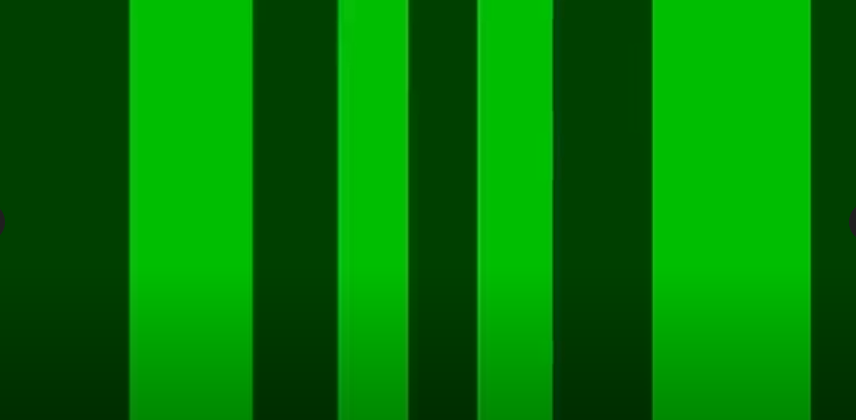

# Descriptions of FlyFlix Stimuli

An explanation of all existing stimulus in FlyFlix.

## Bars

The bar stimulus consists of two types of bars with alternating colors and is the first type of stimulus implemented in FlyFlix. Moving the bars sideways reliably induces a strong behavioral response in _Drosophila_.

In the 3D environment of Three.js, the bars are projected onto a cylindrical virtual arena made from 12 flat panels. In size and shape this simulates the appearance of the [12-12 Arena of the Modular LED Displays](https://reiserlab.github.io/Modular-LED-Display/Generation%204/Arena/docs/arena.html) we use in the [Reiser lab](https://www.janelia.org/lab/reiser-lab). This cylindrical arena surrounds the position of the virtual fly, represented by a [PerspectiveCamera](https://threejs.org/docs/index.html?q=camera#api/en/cameras/PerspectiveCamera). The distance between the virtual fly and the projection plane representing the display in the real setup defines the distortion of the bars towards the edge of the display. The following image shows an example of the bar stimulus:

### Bar Parameters

- `trial_id`: a unique identifier for the trial, preferably an integer number
- `rotate_deg_hz`: movement speed in degrees per second, positive is clockwise
- `osc_freq`: frequency of oscillations - overrides `rotate_deg_hz` and makes trial oscillating trials
- `osc_width`: the width of an oscillation in degrees
- `openloop_duration`: duration of the open loop condition
- `closedloop_duration`: duration of the closed loop condition
- `gain`: multiplier for orientation change read from the FicTrac instance
- `fps`: client frame rate
- `pretrial_duration`: duration of the pre-trial, where the stimulus is shown but not animated. Applies to open loop and closed loop conditions.
- `posttrial_duration`: duration of the post-trial.
- `comment`: additional comment that can be logged with the data
- `bar_deg`: size of the bar (bright) in degree
- `space_deg`: size of the space (dark) in degree
- `sweep`: set to true, if the open loop condition is supposed to be a single stimulus sweep
- `closedloop_bar_deg`: size of the bar (bright) for the closed loop condition in degrees

### Stimulus Specific Files

- [`static/arena/components/panels.js`](static/arena/components/panels.js)
- [`Experiment/spatial_temporal.py`](Experiment/spatial_temporal.py)
- [`Experiment/sweep_condition.py`](Experiment/sweep_condition.py)

## Starfield

The starfield stimulus is a second type of stimulus in FlyFlix that also produces strong, reliable behavioral responses from drosophila. It is currently only found in the `starfield` branch. It is made up of small spheres that are positioned randomly on a spherical shell that has a center at the `camera`'s position. This ensures that all spheres are equally distant from the `camera`. An example of starfield stimulus can be seen below.

### Starfield Parameters

- `trial_id`: a unique identifier for the trial, preferably an integer number
- `rotate_deg_hz`: movement speed in degrees per second, positive is clockwise
- `osc_freq`: frequency of oscillations - overrides `rotate_deg_hz` and makes trial oscillating trials
- `osc_width`: the width of an oscillation in degrees
- `openloop_duration`: duration of the open loop condition
- `closedloop_duration`: duration of the closed loop condition
- `gain`: multiplier for orientation change read from the FicTrac instance
- `fps`: client frame rate
- `pretrial_duration`: duration of the pre-trial, where the stimulus is shown but not animated. Applies to open loop and closed loop conditions.
- `posttrial_duration`: duration of the post-trial.
- `comment`: additional comment that can be logged with the data
- `sphere_count`: the number of spheres surrounding the fly's position
- `sphere_radius_deg`: the radius of the spheres surrounding the fly's position in degrees
- `radius_dev`: the deviation of possible radius sizes from the `sphere_radius_deg` in degrees
- `shell_radius`: the distance between the fly's position and the spheres
- `seed`: a seed that generates a set of random points
- `starfield_closedloop`: boolean that determines if there is a closed loop condition for the trial

### Stimulus Specific Files

- [`static/arena/components/spheres.js`](static/arena/components/spheres.js)
- [`Experiment/starfield_spatial_temporal.py`](Experiment/starfield_spatial_temporal.py)
- [`Experiment/sweep_condition.py`](Experiment/sweep_condition.py)